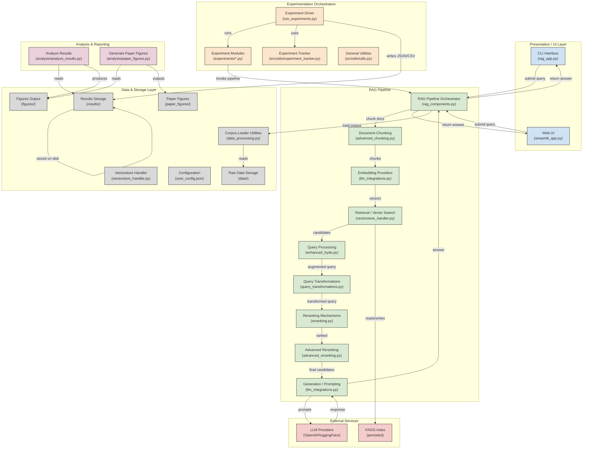

# Advanced RAG-Based Knowledge Management System

This repository contains a comprehensive Retrieval-Augmented Generation (RAG) system designed for both practical knowledge management applications and as an experimental platform for advanced RAG research.

# Advanced RAG System

<div align="center">
  <p>A modular retrieval-augmented generation system designed for experimentation and high-quality responses</p>
  
  
  
  
  
</div>

<hr>


## 🧩 Architecture Components

<div align="center">
  <table>
    <tr>
      <th>Layer</th>
      <th>Description</th>
      <th>Key Files</th>
    </tr>
    <tr>
      <td><div style="background-color:#cfe2f3; width:15px; height:15px; display:inline-block; margin-right:5px;"></div> Presentation</td>
      <td>User interfaces for interacting with the RAG system</td>
      <td><code>rag_app.py</code>, <code>streamlit_app.py</code></td>
    </tr>
    <tr>
      <td><div style="background-color:#d9ead3; width:15px; height:15px; display:inline-block; margin-right:5px;"></div> RAG Pipeline</td>
      <td>Core components that process queries and documents</td>
      <td><code>rag_components.py</code>, <code>advanced_chunking.py</code>, etc.</td>
    </tr>
    <tr>
      <td><div style="background-color:#d9d9d9; width:15px; height:15px; display:inline-block; margin-right:5px;"></div> Data & Storage</td>
      <td>Management of corpus, vectors, and results</td>
      <td><code>vectorstore_handler.py</code>, <code>data_processing.py</code></td>
    </tr>
    <tr>
      <td><div style="background-color:#fce5cd; width:15px; height:15px; display:inline-block; margin-right:5px;"></div> Experimentation</td>
      <td>Tools for running controlled experiments</td>
      <td><code>run_experiments.py</code>, <code>experiment_tracker.py</code></td>
    </tr>
    <tr>
      <td><div style="background-color:#ead1dc; width:15px; height:15px; display:inline-block; margin-right:5px;"></div> Analysis</td>
      <td>Results processing and visualization</td>
      <td><code>analyze_results.py</code>, <code>paper_figures.py</code></td>
    </tr>
    <tr>
      <td><div style="background-color:#f4cccc; width:15px; height:15px; display:inline-block; margin-right:5px;"></div> External Services</td>
      <td>Third-party dependencies</td>
      <td>OpenAI, HuggingFace, FAISS</td>
    </tr>
  </table>
</div>

## ✨ Key Features

- 📝 **Advanced Document Chunking**: Semantic chunking that preserves context
- 🔍 **Enhanced Retrieval**: Multiple retrieval strategies including hybrid search
- 🔄 **Query Transformations**: HyDE, multi-query generation, and query rewriting
- 📊 **Sophisticated Reranking**: Multi-stage reranking with relevance models
- 🧪 **Experimentation Framework**: Tools for controlled testing of RAG variants
- 📈 **Analysis Tools**: Comprehensive evaluation metrics and visualizations
- 🔗 **Modular Design**: Easily swap components for different use cases

## 📚 Architecture Breakdown

<details>
  <summary><b>🖥️ Presentation Layer</b></summary>
  
  The Presentation Layer provides interfaces for users to interact with the RAG system:
  
  - **CLI Interface**: Command-line tool for quick queries and batch processing
  - **Web UI**: Streamlit-based interface for interactive exploration and visualization
  
  These interfaces communicate with the RAG Pipeline Orchestrator to process queries and display results.
</details>

<details>
  <summary><b>⚙️ RAG Pipeline</b></summary>
  
  The RAG Pipeline contains the core components that process user queries and documents:
  
  - **Pipeline Orchestrator**: Coordinates the flow between components
  - **Document Chunking**: Splits documents into semantic units using advanced techniques
  - **Embedding Providers**: Converts text into vector representations
  - **Retrieval**: Searches vector store for relevant document chunks
  - **Query Processing**: Enhances queries using techniques like HyDE
  - **Query Transformations**: Generates query variations to improve recall
  - **Reranking**: Improves precision by reordering retrieved chunks
  - **Advanced Reranking**: Uses LLM feedback for further refinement
  - **Generation**: Creates final responses using retrieved context
</details>

<details>
  <summary><b>💾 Data & Storage Layer</b></summary>
  
  This layer manages all data assets and persistence:
  
  - **Raw Data Storage**: Original documents in various formats
  - **Corpus Loader**: Utilities for loading and preprocessing documents
  - **Vectorstore Handler**: Interface to vector databases and indices
  - **Configuration**: User settings and system parameters
  - **Results Storage**: Experiment outputs and evaluation metrics
</details>

<details>
  <summary><b>🧪 Experimentation Layer</b></summary>
  
  Tools for systematic testing of RAG variants:
  
  - **Experiment Driver**: Controls execution of experiment batches
  - **Experiment Modules**: Individual experiment configurations
  - **Experiment Tracker**: Logs metrics and parameters
  - **General Utilities**: Helper functions for experimentation
</details>

## 🔄 Process Flow

This system processes queries through the following steps:

1. **User Input**: Query submitted via CLI or Web interface
2. **Query Enhancement**: Initial query is processed and potentially transformed
3. **Document Retrieval**: Relevant chunks retrieved from vector store
4. **Reranking**: Results are refined based on relevance
5. **Context Preparation**: Selected chunks formatted as context
6. **Response Generation**: LLM generates the final answer
7. **Result Delivery**: Response returned to user with supporting evidence





## Live Demo

Try the live application: [Advanced RAG Knowledge Management System](https://advanced-rag-system.streamlit.app/)


## Table of Contents
- [Overview](#overview)
- [Key Features](#key-features)
- [Directory Structure](#directory-structure)
- [Installation](#installation)
- [Usage](#usage)
- [Experiments](#experiments)
- [Research Paper Generation](#research-paper-generation)
- [Extending the System](#extending-the-system)

## Overview

Retrieval-Augmented Generation (RAG) combines the strengths of retrieval-based and generative approaches to enhance the quality, accuracy, and factual grounding of AI-generated responses. This project provides:

1. A complete end-to-end RAG system for knowledge management
2. An experimentation platform for evaluating different RAG components 
3. Analysis tools for research and paper writing

The system allows for extensive experimentation with different RAG approaches including various document chunking strategies, embedding models, retrieval methods, query processing techniques, reranking mechanisms, and generation prompt engineering.

## Key Features

- **Modular architecture** for easy experimentation with different RAG components
- **Multiple chunking strategies**: fixed-size, paragraph-based, and semantic chunking
- **Various embedding models**: SentenceTransformers, OpenAI, and Hugging Face models
- **Multiple retrieval methods**: Vector search, BM25, and hybrid approaches
- **Advanced query processing**: Query expansion, reformulation, and HyDE
- **Reranking mechanisms**: Cross-encoder, LLM-based, and fusion approaches
- **Comprehensive evaluation metrics**: Precision, recall, MRR, faithfulness, etc.
- **Experiment tracking and visualization tools**
- **Web interface** for interactive usage (Streamlit)
- **Analysis tools** for research paper generation

## Codebase Statistics

Below are some high-level stats on this repository (as of `v2.0`):

- **Lines of Code**: 8 000+ Python lines across 30+ modules  
  _Counted with a custom Python script that strips comments and blank lines._
- **Controlled Experiments**: ≈ 70 runs over a 50-query benchmark set  
  - Achieved up to **0.91 Precision@4** and **0.89 Recall@4**  
  - All CSVs & charts live in `results/` and can be rerun via `run_experiments.py`

You can reproduce the LOC count yourself:

```bash
# Count non-blank, non-comment Python lines in src/
find src/ -name '*.py' -print0 \
  | xargs -0 sed '/^\s*#/d;/^\s*$/d' \
  | wc -l
```


## Directory Structure

```
advanced_rag_system/
├── README.md                   # Project documentation
├── requirements.txt            # Python dependencies
├── .env                        # Environment variables (API keys)
├── .gitignore                  # Git ignore file
├── run_experiments.py          # End-to-end experiment runner
├── test_refactoring.py         # Test script for refactoring
├── experiment_run.log          # Log file for experiment runs
├── user_config.json            # User configuration file
├── paper_template.md           # IEEE paper template
├── src/
│   ├── components/
│   │   ├── rag_components.py   # Core RAG functionality
│   │   ├── advanced_chunking.py # Enhanced semantic chunking
│   │   ├── enhanced_hyde.py    # Enhanced HyDE implementation
│   │   ├── advanced_reranking.py # Multi-stage reranking
│   │   ├── reranking.py        # Basic reranking implementations
│   │   ├── evaluation.py       # Evaluation metrics
|   |   ├── data_processing.py    # Data processing utilities
|   |   ├── evaluation_dataset.py # Evaluation dataset
|   |   ├── evaluation_runner.py  # Evaluation runner
|   |   ├── llm_integration.py    # Integration with LLMs
|   |   ├── query_transformations.py # Query transformations
|   |   └── vectorstore_handler.py # Vectorstore handler
│   ├── utils/
│   │   ├── experiment_tracker.py # Experiment tracking
|   |   └── utils.py                # Utility functions
│   └── app/
│       ├── rag_app.py          # Demo application
│       └── streamlit_app.py    # Web interface
├── experiments/
│   ├── test_framework.py       # Initial framework test
│   ├── chunking_experiment.py  # Chunking comparisons
│   ├── embedding_experiment.py # Embedding comparisons
│   ├── retrieval_experiment.py # Retrieval method comparisons
│   ├── query_processing_experiment.py
│   ├── reranking_experiment.py # Reranking comparisons
│   └── generation_experiment.py # Generation comparisons
├── analysis/
│   ├── analyze_results.py      # Results analysis
│   └── paper_figures.py        # Paper figure generation
├── data/                       # Directory for data files
│   └── .gitkeep                # Empty file to keep directory in git
|   ├── evaluation
|   |   └── rag_example.json
|   └── faiss_index
|       ├── index.faiss
|       └── index.pkl
└── results/                    # Experiment results
    └── .gitkeep                # Empty file to keep directory in git
```

## Installation

1. Clone the repository:
```bash
git clone https://github.com/Arshnoor-Singh-Sohi/Advanced-RAG-System.git
cd advanced-rag-system
```

2. Create and activate a virtual environment (recommended):
```bash
python -m venv venv
source venv/bin/activate  # On Windows: venv\Scripts\activate
```

3. Install the requirements:
```bash
pip install -r requirements.txt
```

4. (Optional) Set up API keys for external services:
If you want to use OpenAI embeddings or other paid services, set up your API keys:
```bash
export OPENAI_API_KEY=your_api_key_here
```

## Usage

### Running the Demo Application

To run the command-line demo application:

```bash
python -m src.app.rag_app --corpus path/to/your/corpus.pkl
```

### Running the Web Interface

To launch the Streamlit web interface:

```bash
streamlit run src.app.streamlit_app
```

This will open a browser window with the RAG web interface where you can:
- Upload your own documents
- Configure the RAG pipeline
- Ask questions and get answers
- View performance metrics

### Creating a Corpus

You can create a corpus in several ways:

1. **Upload files through the Streamlit interface**
2. **Convert files programmatically**:

```python
from src.components.rag_components import DocumentChunker

# Create corpus from text files
corpus = []
for file_path in text_files:
    with open(file_path, 'r') as f:
        text = f.read()
        corpus.append({
            "title": os.path.basename(file_path),
            "text": text
        })

# Save corpus
import pickle
with open("data/my_corpus.pkl", "wb") as f:
    pickle.dump(corpus, f)
```

## Experiments

The system includes several experiment scripts for evaluating different aspects of RAG systems:

### Running Individual Experiments

```bash
# Test the framework
python -m experiments.test_framework

# Run chunking experiments
python -m experiments.chunking_experiment --corpus data/my_corpus.pkl --output-dir results

# Run embedding experiments
python -m experiments.embedding_experiment --corpus data/my_corpus.pkl --output-dir results

# Run retrieval experiments
python -m experiments.retrieval_experiment --corpus data/my_corpus.pkl --output-dir results

# Run query processing experiments
python -m experiments.query_processing_experiment --corpus data/my_corpus.pkl --output-dir results

# Run reranking experiments
python -m experiments.reranking_experiment --corpus data/my_corpus.pkl --output-dir results

# Run generation experiments
python -m experiments.generation_experiment --corpus data/my_corpus.pkl --output-dir results
```

### Running All Experiments

To run a comprehensive suite of experiments:

```bash
python run_experiments.py --corpus data/my_corpus.pkl --output-dir results
```

## Research Paper Generation

After running experiments, you can analyze the results and generate figures for your research paper:

```bash
# Analyze results
python -m analysis.analyze_results --results-dir results --output-dir figures

# Generate paper figures
python -m analysis.paper_figures --results-dir results --output-dir paper_figures
```

This will create:
1. Analysis of each component's performance
2. Comparison of different configurations
3. High-quality figures and tables for an IEEE-format paper
4. JSON files with recommendations and insights

## Extending the System

### Adding New Chunking Strategies

Extend the `DocumentChunker` class in `src/components/rag_components.py`:

```python
@staticmethod
def chunk_by_your_method(documents: List[Dict[str, str]]) -> List[Dict[str, str]]:
    """Your new chunking strategy"""
    chunked_docs = []
    # Implement your chunking logic
    return chunked_docs
```

### Adding New Embedding Models

Extend the `EmbeddingProvider` class in `src/components/rag_components.py`:

```python
@staticmethod
def get_your_embeddings(texts: List[str], model_name: str) -> np.ndarray:
    """Get embeddings using your model"""
    # Implement your embedding logic
    return embeddings
```

### Adding New Retrieval Methods

Extend the `RetrievalMethods` class in `src/components/rag_components.py`:

```python
@staticmethod
def your_search(query: str, ...) -> List[Tuple[str, float]]:
    """Your retrieval method"""
    # Implement your retrieval logic
    return results
```


## Citation

If you use this system in your research, please cite:

```
@article{your_name2025advanced,
  title={Advanced RAG-Based Knowledge Management System},
  author={Arshnoor Singh Sohi},
  year={2025}
}
```

## Acknowledgments

This project leverages the following open-source libraries:
- LangChain
- Sentence-Transformers
- FAISS
- HuggingFace Transformers
- Streamlit
